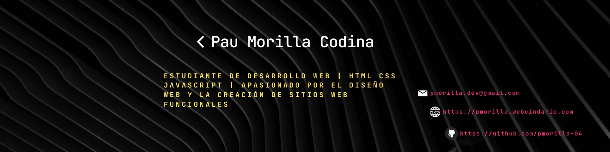
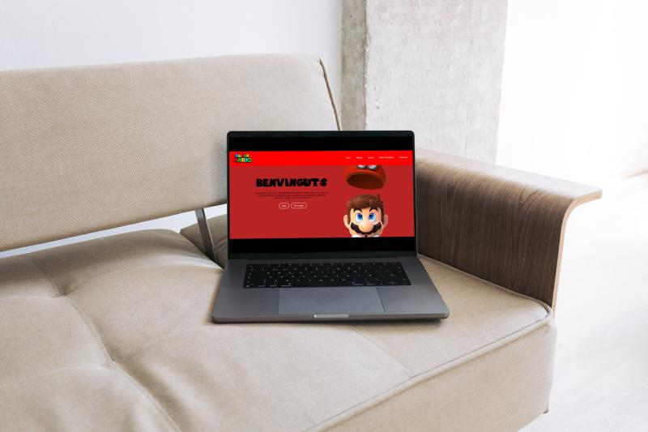

<h1>BIENVENIDOS AL PERFIL DE PAU MORILLA 👋</h1>

<h2>💫 Sobre Mi</h2> 
<h2>Hola!! Yo soy Pau Morilla</h2>
Me llamo Pau Morilla, tengo 21 años y vivo en Folgueroles. Actualmente estoy cursando un Certificado de Profesionalidad en Confección y Publicación de Páginas Web, donde estoy adquiriendo conocimientos prácticos en HTML, CSS, JavaScript y WordPress.

Este próximo septiembre cursaré el Grado Superior en Desarrollo de Aplicaciones Web (DAW), con el objetivo de seguir formándome en programación, bases de datos y desarrollo de aplicaciones web.

<h2>🎓 Educacion </h2>
<ul>
  <li>🧑‍🎓 Grado Superior en Desarrollo de Aplicaciones Web (DAW)
Inicio en septiembre de 2025</li>
  <li>📚 Formación autodidacta en desarrollo web
</li>
  <li>💻 Certificado de Profesionalidad: Confección y Publicación de Páginas Web
Enero – Junio 2025</li>
  <li>🛠️ Curso de Impresión 3D y prototipado
Diseño y fabricación con impresoras de resina, láser y herramientas básicas</li>
  <li>🏫 Educación Secundaria Obligatoria (ESO)
Septiembre 2016 – Junio 2020</li>
</ul>

<h2>🌱 Actualmente estoy mejorando mis habilidades</h2>
Actualmente estoy reforzando mis conocimientos en tecnologías front-end mientras me preparo para iniciar un ciclo superior en Desarrollo de Aplicaciones Web(DAW). Creando proyectos con HTML, CSS, JavaScript, WordPress y elementor.

<h2>👨‍💻 Proyectos</h2>
Todos mis proyectos los puedes ver en mi portafolio. Cada proyecto incluye descripciónes detalladas, tecnologías utilizadas, enlaces al codigo en github y enlaces para ver el proyecto en vivo.

<h2>🌐 Link al Portafolio</h2>
Mi portafolio weeb esta disponble en este enlace: https://pmorilla.webcindario.com 

<h2>💬 Peguntame sobre</h2>
<ul>
  <li>HTML5</li>
  <li>CSS3</li>
  <li>JavaScript</li>
  <li>Wordpress</li>
  <li>Elementor</li>
</ul>

<h2>📫 Cómo contactarme</h2>
Me puedes contactar a traves de mi correo electronico que és: pmorilla.dev@gmal.com 

<h2>🌐 Redes sociales</h2>

<h2>💻 Habilidades Tecnicas</h2>

<h2>📌 Proyectos destacados</h2>
<h3>🎮 Web de Super Mario</h3>
Proyecto web inspirado en el universo clásico de Super Mario Bros. Uso de HTML, CSS y JavaScript para crear una experiencia retro con diseño visual pixelado y sonidos personalizados.  

🔗 [Ver repositorio](https://github.com/pmorilla-04/super-mario)

<h3> ⛷️ Web de esquí (en desarrollo)</h3>
Página informativa sobre distintos tipos de esquí. Contiene un slideshow hecho con bootstrap y efecto parallax en la portada. Proyecto aún en desarrollo. 

🔗 [Ver repositorio](https://github.com/pmorilla-04/esqui-web)

<h3> 🚴 Web de viajes en bicicleta</h3>
Sitio web dedicado a rutas ciclistas, con información detallada sobre cada recorrido, incluyendo distancia, desnivel y fotografías propias. El diseño se ha creado con WordPress utilizando el tema Astra y el editor Elementor, para ofrecer una experiencia visual limpia, fácil de navegar y adaptada a dispositivos móviles.

